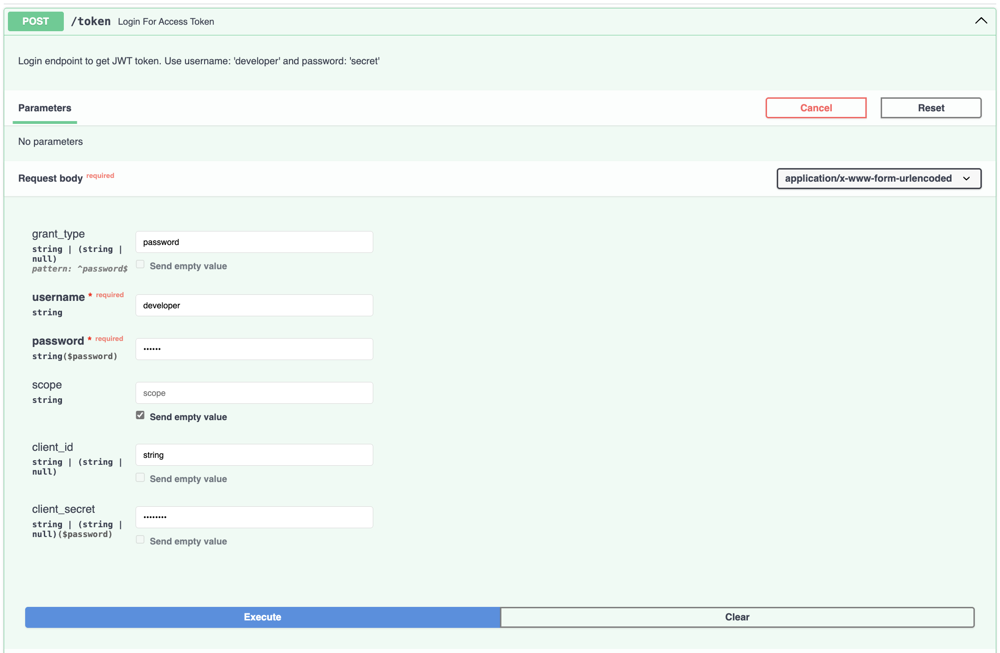
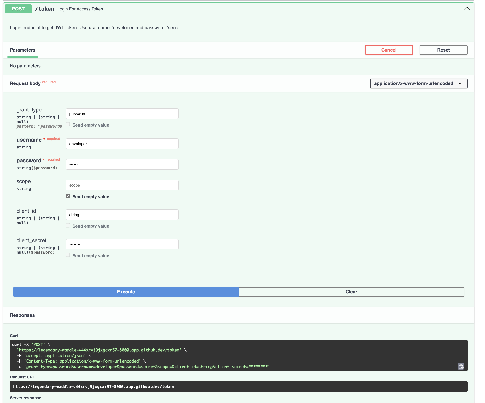
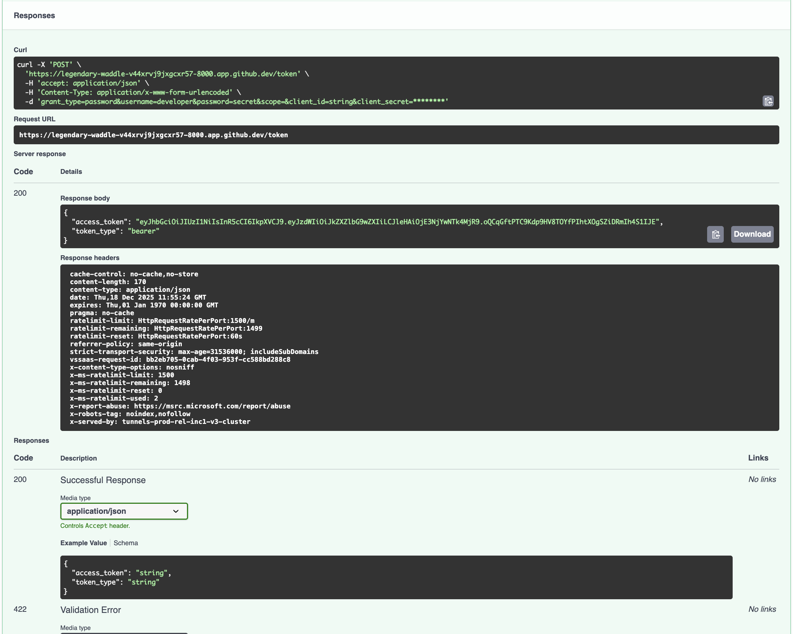
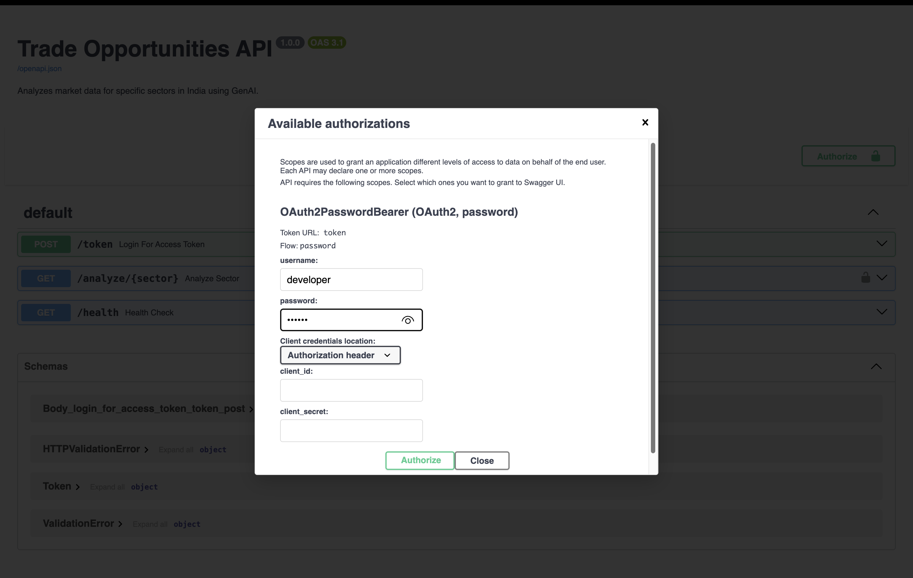
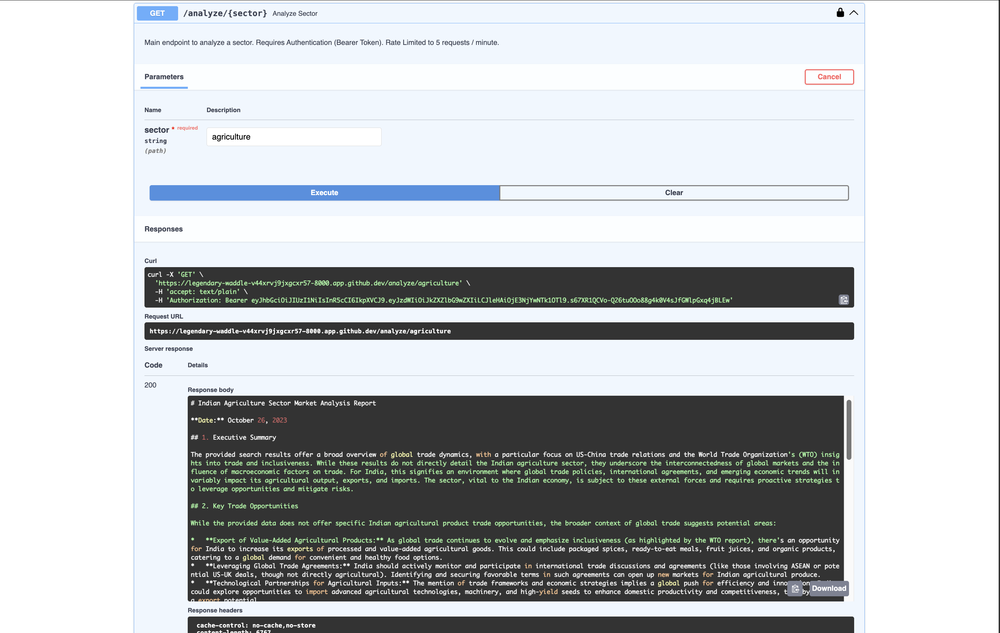
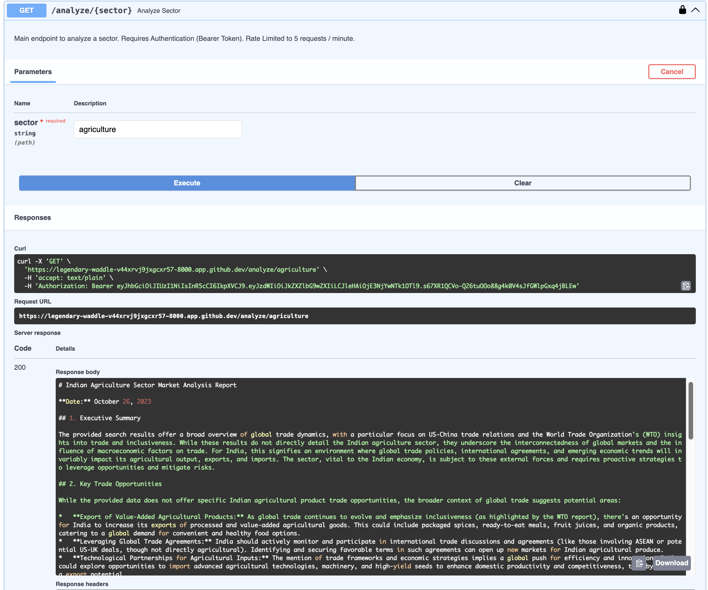
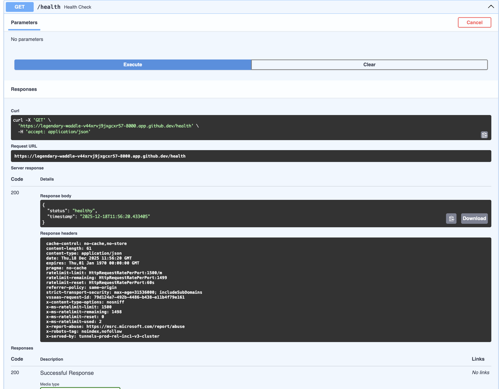
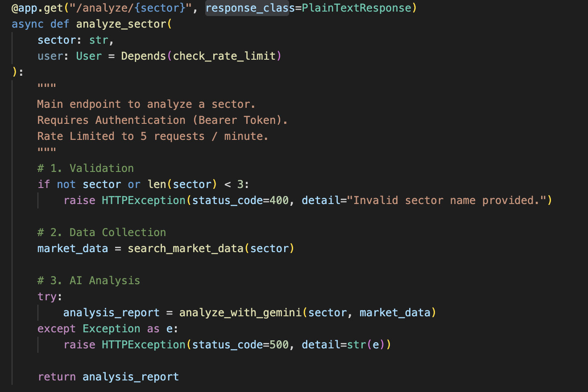

**Table of Contents:**
- [Simple Implementation](#simple-implementation)
    - [Backend Framework](#backend-framework)
    - [Session Management](#session-management)
    - [Rate Limiting](#rate-limiting)
    - [Security Best Practices](#security-best-practices)
    - [Input Validation](#input-validation)
    - [AI/Data Sources](#aidata-sources)
    - [Storage](#storage)
    - [Security](#security)
    - [API Specification](#api-specification)
  - [Output \& Implementation Screenshots](#output--implementation-screenshots)
    - [Access Token Generation](#access-token-generation)
    - [Authorization](#authorization)
    - [Analyze Sector Endpoint](#analyze-sector-endpoint)
    - [Health Check](#health-check)
    - [Input/output Validation or type checking](#inputoutput-validation-or-type-checking)
---
Implementation MOCK can be viewed as [Swagger MOCK](Artifacts/Trade%20Opportunities%20API%20-%20Swagger%20UI.mhtml)

# Simple Implementation
---
This document provides a detailed breakdown of the components and libraries used in the Simple Implementation of the FastAPI application for market analysis reports.

### Backend Framework
- **FastAPI**  
  - **Library:** fastapi  
  - **How it works:** Provides the main API framework, routing, dependency injection, and async support. The app is created with `FastAPI()` and endpoints are defined using decorators like `@app.get()` and `@app.post()`.

---

### Session Management
- **In-memory session tracking**  
  - **How it works:** User sessions are tracked using JWT tokens (stateless) and in-memory Python dictionaries for rate limiting and user data. No external session store is used.

---

### Rate Limiting
- **Custom in-memory rate limiter**  
  - **How it works:**  
    - Uses a `defaultdict(list)` to store timestamps of user requests.
    - Checks the number of requests in a sliding window (e.g., 5 requests per 60 seconds).
    - Raises HTTP 429 if the limit is exceeded.
  - **Location:** `check_rate_limit()` function.

---

### Security Best Practices
- **Password Hashing:**  
  - **Library:** passlib (with pbkdf2_sha256)  
  - **How it works:** Passwords are hashed and verified securely.
- **JWT Authentication:**  
  - **Libraries:** fastapi.security, python-jose  
  - **How it works:** JWT tokens are issued on login and required for protected endpoints.
- **Error Handling:**  
  - **How it works:** Uses FastAPI’s `HTTPException` for clear error responses.

---

### Input Validation
- **Library:** pydantic  
  - **How it works:** Request and response models (e.g., `Token`, `User`) ensure data is validated and typed. Endpoint parameters (like `sector`) are checked for validity (e.g., minimum length).

---

### AI/Data Sources

- **LLM: Google Gemini API**  
  - **Library:** google-generativeai  
  - **How it works:**  
    - The `analyze_with_gemini()` function sends a prompt and market data to Gemini via the API key.
    - Returns a structured markdown report.

- **Web Search: DuckDuckGo**  
  - **Library:** duckduckgo-search  
  - **How it works:**  
    - The `search_market_data()` function uses `DDGS` to fetch recent news and data for the given sector.

- **Data Collection:**  
  - **How it works:**  
    - Data is collected via web search APIs (DuckDuckGo) and passed to the LLM for analysis.
    - No manual scraping is implemented, but the structure allows for it.

---

### Storage
- **In-memory only**  
  - **How it works:**  
    - All user data, rate limits, and session info are stored in Python dictionaries in memory.
    - No database is used.

---

### Security
- **Authentication:**  
  - **Library:** fastapi.security, python-jose, passlib  
  - **How it works:**  
    - JWT-based authentication with hashed passwords.
    - Only authenticated users can access the main endpoint.

- **Input Validation:**  
  - **Library:** pydantic, FastAPI parameter validation  
  - **How it works:**  
    - Ensures only valid sector names are processed.

- **Rate Limiting:**  
  - **How it works:**  
    - See above; enforced per user/session.

---

### API Specification
- **Single Endpoint:**  
  - **GET /analyze/{sector}**  
  - **How it works:**  
    - Accepts a sector name, collects data, analyzes it with Gemini, and returns a markdown report.
    - Requires authentication and is rate-limited.

---

**Summary Table:**

| Feature                | Library/Model                | How it Works (Short)                                 |
|------------------------|------------------------------|------------------------------------------------------|
| FastAPI                | fastapi                      | Main API framework                                   |
| Session Management     | JWT, in-memory dict          | JWT tokens + in-memory tracking                      |
| Rate Limiting          | Python dict, FastAPI         | Sliding window, per-user, in-memory                  |
| Security Best Practices| passlib, python-jose         | Hashed passwords, JWT, error handling                |
| Input Validation       | pydantic, FastAPI            | Typed models, parameter checks                       |
| LLM (AI)               | google-generativeai (Gemini) | Market analysis via prompt to Gemini                 |
| Web Search             | duckduckgo-search            | Fetches sector news/data                             |
| Storage                | In-memory dicts              | No database, all in RAM                              |
| Authentication         | fastapi.security, passlib    | JWT, hashed passwords                                |

---

## Output & Implementation Screenshots

Below are images demonstrating different aspects of the implementation and outputs:

### Access Token Generation

### Authorization

### Analyze Sector Endpoint

### Health Check

### Input/output Validation or type checking

